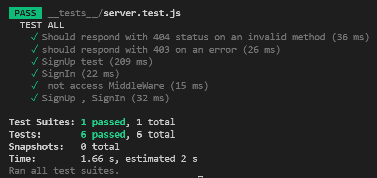
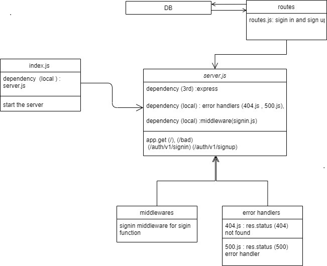

# Basic-Auth

## [Heroku](https://amr-basic-auth.herokuapp.com/)

## [pull request](https://github.com/amr88nzzal/basic-auth/pulls)

## In this project you can find

+ middleware
+ testing unit (jest + supertest)
+ DataBase (Postgres)
+ Auth(BASE-64 and HASH Data)
+ workflows

## **Setup**

**.env requirements :**

    - PORT=3030
    - DATABASE_URL=postgres://localhost:5432/basic_auth

**Dependencies needs to install**

    * npm init -y
    * npm i dotenv express cors
    * npm i -D jest supertest
    * npm i sequelize
    * npm i sqlite3
    * npm i pg

**To Run the Application :**

- clone the repository
- run the command (`npm run dev`)

---

## **Testing**

---
## UML
